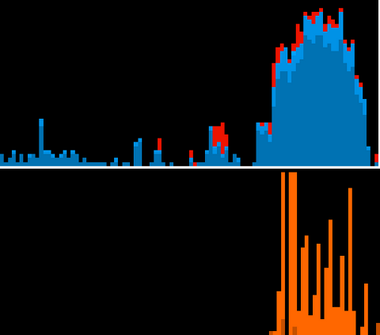
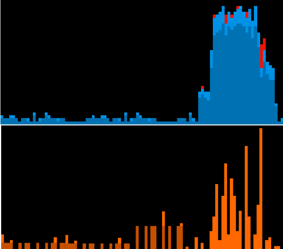

!SLIDE center
# System Monitor

!SLIDE
# Red "snow" is IO Wait

!SLIDE 
# EXT4 journal_data
### When the filesystem is mounted with journalling enabled, all data (not just metadata) is **committed into the journal prior to being written** into the main filesystem. - man tune2fs

!SLIDE 
# EXT4 journal_data_writeback
### When the filesystem is mounted with journalling enabled, data **may be written into the main filesystem after its metadata has been committed to the journal**. This may **increase throughput**, however, it **may allow old data to appear in files after a crash** and journal recovery. - man tune2fs

!SLIDE
# "May increase throughput"
## Sign me up!

!SLIDE
# "Old data after crash"
## oh no, not my test data!

!SLIDE
# Don't try this in production
## oh no, my credit card transactions!

!SLIDE
# HFS
## No such option :-(

!SLIDE
# atime
## update "access time" when file is read

!SLIDE
# atime
## every file read **causes a file write**

!SLIDE
# noatime
## don't update access time

!SLIDE center
# Before

!SLIDE center
# After

!SLIDE bullets incremental
# Data is not flushed
* Stays in paged memory
* Flushed when convenient

!SLIDE
# As fast as a ramdisk
### (I tried it)

!SLIDE
# As fast as an SSD
### (I tried it)

!SLIDE
# As fast as an SSD
### However SSDs make "first loads" faster

